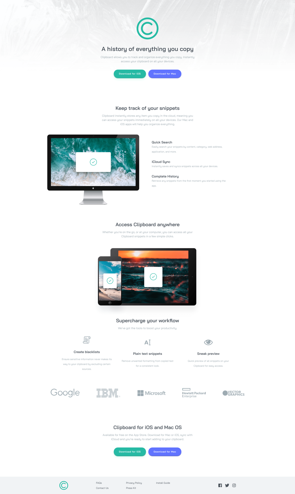

# Frontend Mentor - Clipboard landing page solution

This is a solution to the [Clipboard landing page challenge on Frontend Mentor](https://www.frontendmentor.io/challenges/clipboard-landing-page-5cc9bccd6c4c91111378ecb9). Frontend Mentor challenges help you improve your coding skills by building realistic projects.

## Table of contents

- [Overview](#overview)
  - [The challenge](#the-challenge)
  - [Screenshot](#screenshot)
  - [Links](#links)
- [My process](#my-process)
  - [Built with](#built-with)
  - [What I learned](#what-i-learned)
- [Author](#author)

## Overview

### The challenge

Users should be able to:

- View the optimal layout for the site depending on their device's screen size
- See hover states for all interactive elements on the page

### Screenshot



### Links

- Solution URL: [Add solution URL here](https://your-solution-url.com)
- Live Site URL: [Add live site URL here](https://your-live-site-url.com)

## My process

### Built with

- Semantic HTML5 markup
- Flexbox
- CSS Grid

### What I learned

```html
<main>
  <section class="heading-1">
    <h2>Keep track of your snippets</h2>
    <p>
      Clipboard instantly stores any item you copy in the cloud, meaning you can
      access your snippets immediately on all your devices. Our Mac and iOS apps
      will help you organize everything.
    </p>
  </section>

  <section class="description">
    

    <div class="advantages">
      <h3>Quick Search</h3>
      <p>
        Easily search your snippets by content, category, web address,
        application, and more.
      </p>
      <h3>iCloud Sync</h3>
      <p>Instantly saves and syncs snippets across all your devices.</p>
      <h3>Complete History</h3>
      <p>
        Retrieve any snippets from the first moment you started using the app.
      </p>
    </div>
  </section>

  <section class="heading-2">
    <h2>Access Clipboard anywhere</h2>
    <p>
      Whether you’re on the go, or at your computer, you can access all your
      Clipboard snippets in a few simple clicks.
    </p>

    
  </section>

  <section class="heading-3">
    <h2>Supercharge your workflow</h2>
    <p>We’ve got the tools to boost your productivity.</p>
  </section>

  <section class="benefits">
    <div class="blacklist">
      
      <h3>Create blacklists</h3>
      <p>
        Ensure sensitive information never makes its way to your clipboard by
        excluding certain sources.
      </p>
    </div>

    <div class="text-snippets">
      
      <h3>Plain text snippets</h3>
      <p>Remove unwanted formatting from copied text for a consistent look.</p>
    </div>

    <div class="sneak-preview">
      
      <h3>Sneak preview</h3>
      <p>Quick preview of all snippets on your Clipboard for easy access.</p>
    </div>
  </section>

  <section class="brands">
    
    
    
    
    
  </section>

  <section class="heading-4">
    <h2>Clipboard for iOS and Mac OS</h2>
    <p>
      Available for free on the App Store. Download for Mac or iOS, sync with
      iCloud and you’re ready to start adding to your clipboard.
    </p>

    <div class="btns bottom-buttons">
      <button class="btn bottom-button-1">Download for iOS</button>
      <button class="btn bottom-button-2">Download for Mac</button>
    </div>
  </section>
</main>
```

```css
@media only screen and (max-width: 600px) {
  header h1,
  header p,
  h2,
  h2 ~ p {
    width: 90%;
    margin-left: 50%;
    transform: translate(-50%, 0);
    text-align: center;
  }

  .heading-1 {
    margin-top: 150px;
  }

  .heading-2 {
    display: flex;
    flex-direction: column;
    justify-content: center;
    align-items: center;
  }

  .heading-2 h2,
  .heading-2 p {
    margin-left: 0;
    transform: translate(0, 0);
  }

  .description {
    margin-top: 100px;
    display: flex;
    flex-direction: column;
    justify-content: center;
    align-items: center;
  }

  .advantages {
    width: 90%;
  }

  .description img,
  .heading-2 img {
    height: 225px;
    margin-left: 0;
    transform: translate(0, 0);
  }

  .heading-3 {
    margin-top: 100px;
  }

  .benefits {
    margin-top: 96px;
    display: flex;
    flex-direction: column;
  }

  .brands {
    flex-direction: column;
    gap: 72px;
  }

  .btns {
    flex-direction: column;
    align-items: center;
    gap: 18px;
  }

  .btn {
    width: 250px;
  }

  footer {
    height: 400px;
    margin-top: 150px;
    display: flex;
    flex-direction: column;
    gap: 48px;
  }

  .bottom-links {
    margin-left: 0;
    display: flex;
    flex-direction: column;
    justify-content: center;
    align-items: center;
    gap: 24px;
  }
}
```

## Author

- Frontend Mentor - [@yourusername](https://www.frontendmentor.io/profile/yourusername)
